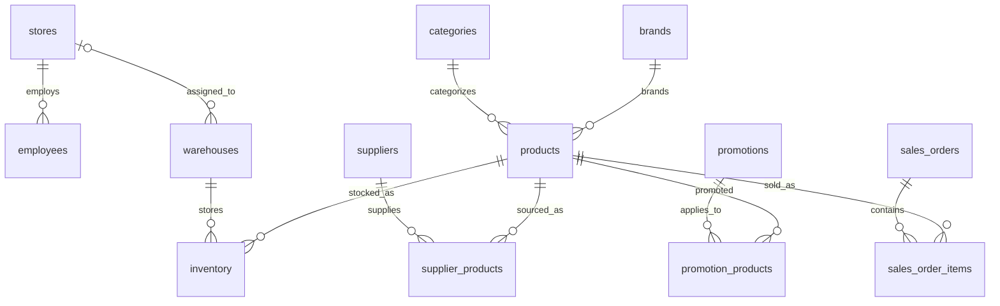

# Base de datos de referencia

SQLite es la implementación de referencia para la base operacional local: no requiere
servidor, permite crear una base reproducible con la biblioteca estándar de Python y
mantiene la integridad referencial habilitada. La arquitectura futura podrá contemplar
dialectos adicionales, pero PostgreSQL y SQL Server no están soportados actualmente.

Ejecute `python scripts/create_database.py` para crear `data/business_demo.sqlite`.
El comando no reemplaza una base existente; use `--force` para regenerarla, o `--path`
para elegir otra ubicación.

## Dominios y tablas

- Organización: `stores`, `warehouses`, `employees`.
- Catálogo: `categories`, `brands`, `products`.
- Proveedores: `suppliers`, `supplier_products`.
- Clientes: `customer_segments`, `customers`.
- Promociones: `promotions`, `promotion_products`.
- Ventas: `sales_orders`, `sales_order_items`, `payments`.
- Devoluciones: `returns`, `return_items`.
- Compras: `purchase_orders`, `purchase_order_items`.
- Inventario: `inventory`, `inventory_movements`.
- Gestión: `sales_targets`.

Las 22 tablas están vacías al crearse. Los importes monetarios se almacenan en
céntimos como enteros, para evitar imprecisión de punto flotante.

## Relaciones principales

Las tiendas agrupan empleados y pueden asociarse opcionalmente a almacenes. Productos
pertenecen a una categoría y marca; proveedores y promociones se relacionan con ellos
mediante tablas puente. Una venta vincula tienda, cliente opcional y vendedor, y sus
líneas pueden tener promoción. Compras e inventario se registran por almacén y producto.
Las devoluciones se enlazan tanto a la venta como a su línea original.

