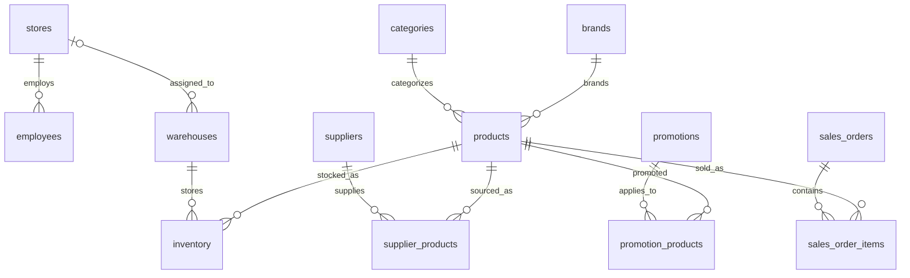

# Base de datos de referencia

WideWorldImporters sobre SQL Server es ahora la base de referencia para la integración
del proyecto. El entorno local utiliza Windows Authentication mediante Microsoft ODBC
Driver for SQL Server. `TrustServerCertificate=true` es exclusivo de desarrollo local y
no representa una política TLS para producción.

El generador SQLite permanece temporalmente para el dataset sintético, pero no es la
nueva base de referencia de integración.

Configure `DB_SERVER`, `DB_NAME` y `DB_DRIVER` en `.env`, tomando `.env.example` como
guía, y ejecute `python scripts/check_database.py` para verificar la conexión.

## Dominios y tablas

- Organización: `stores`, `warehouses`, `employees`.
- Catálogo: `categories`, `brands`, `products`.
- Proveedores: `suppliers`, `supplier_products`.
- Clientes: `customer_segments`, `customers`.
- Promociones: `promotions`, `promotion_products`.
- Ventas: `sales_orders`, `sales_order_items`, `payments`.
- Devoluciones: `returns`, `return_items`.
- Compras: `purchase_orders`, `purchase_order_items`.
- Inventario: `inventory`, `inventory_movements`.
- Gestión: `sales_targets`.

Las 22 tablas están vacías al crearse. Los importes monetarios se almacenan en
céntimos como enteros, para evitar imprecisión de punto flotante.

Las fechas se almacenan como texto ISO 8601: `YYYY-MM-DD` para fechas y timestamps ISO
8601 cuando corresponde. Esta representacion mantiene consistentes las comparaciones de
fechas realizadas sobre columnas `TEXT`.

## Relaciones principales

Las tiendas agrupan empleados y pueden asociarse opcionalmente a almacenes. Productos
pertenecen a una categoría y marca; proveedores y promociones se relacionan con ellos
mediante tablas puente. Una venta vincula tienda, cliente opcional y vendedor, y sus
líneas pueden tener promoción. Compras e inventario se registran por almacén y producto.
Las devoluciones se enlazan tanto a la venta como a su línea original.

